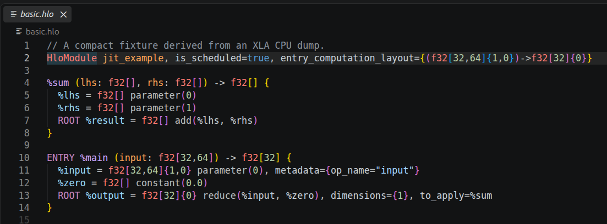
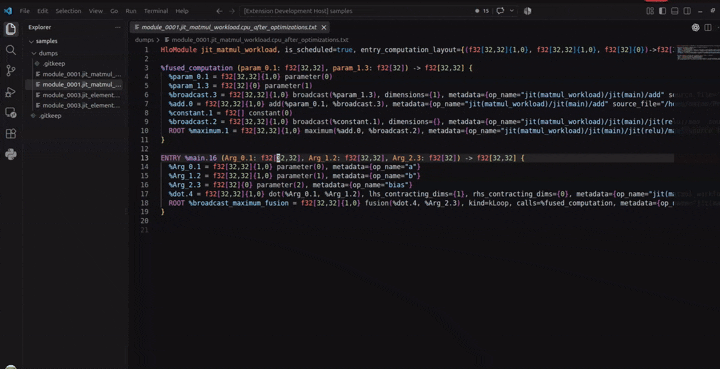

# HLO Prettier

Readable XLA HLO, right inside Visual Studio Code.

HLO Prettier combines theme-friendly syntax highlighting with configurable
document formatting for `.hlo` files and common XLA/JAX text dumps.



## Highlights

- Highlights modules, computations, shapes, primitive types, identifiers,
  attributes, literals, strings, and comments.
- Formats indentation, horizontal spacing, instruction attributes, and spacing
  between computations.
- Supports **Format Document**, format on save, spaces, and tabs.
- Preserves strings, comments, and metadata that you choose not to format.
- Handles incomplete HLO without getting in your way.

## Format HLO

Open the Command Palette and run **Format Document**, or use your usual VS Code
formatting shortcut. Select **HLO Prettier** if VS Code asks you to choose a
formatter.



For automatic formatting, add this to your VS Code `settings.json`:

```json
{
  "[hlo]": {
    "editor.defaultFormatter": "5yearsKim.hlo-prettier",
    "editor.formatOnSave": true,
    "editor.insertSpaces": true,
    "editor.tabSize": 2
  },
  "hloPrettier.printWidth": 120,
  "hloPrettier.attributeWrapping": "auto",
  "hloPrettier.formatMetadata": false,
  "hloPrettier.blankLinesBetweenComputations": 1
}
```

## Settings

| Setting | Default | What it controls |
| --- | --- | --- |
| `hloPrettier.printWidth` | `120` | Line width used by automatic attribute wrapping |
| `hloPrettier.attributeWrapping` | `"auto"` | Attribute wrapping: `auto`, `preserve`, or `onePerLine` |
| `hloPrettier.formatMetadata` | `false` | Whether metadata internals are formatted |
| `hloPrettier.blankLinesBetweenComputations` | `1` | Blank lines between top-level computations (`0`–`2`) |

Indentation follows VS Code's `editor.insertSpaces` and `editor.tabSize`
settings for HLO files.

## Recognized files

HLO Prettier recognizes `.hlo` files and these common dump patterns without
taking over every `.txt` file:

```text
module_*.jit_*.txt
*before_optimizations.txt
*.cpu_after_optimizations.txt
*.gpu_after_optimizations.txt
```

For another filename, select **HLO** using VS Code's language-mode picker.

## License

[Apache License 2.0](LICENSE)
